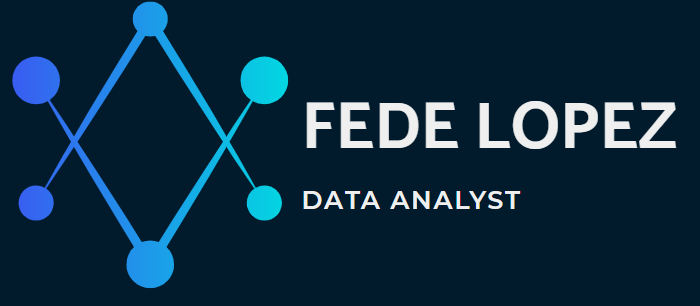

<h1 align="center">Hola, soy Fede👋</h1>

  

        <h2>🌟 About Me</h2>
        <ul>
            <li class="highlight">🚀 Junior Data Analyst 
            <li class="highlight">📚 High School CS Teacher 
            <li class="highlight">💡 IT Enthusiast 
        </ul>
    

   

    <h2>🛠️ Tech Toolkit</h2>
    

        🐍 Python | 📊 Power BI | 🗄️ SQL  📑 Excel | 🐼 Pandas | 📉 Matplotlib
    

    <h2>🎓 Education</h2>
    <ul>
        <li>🏛️ <strong>Systems Engineering</strong> | Universidad Tecnológica Nacional | 2019–2024</li>
        <li>💻 <strong>Software Engineering</strong> | Universidad Siglo 21 | 2024–Present</li>
    </ul>

    <h2>📚 Courses & Certifications</h2>
    <ul>
        <li>📊 <strong>SQL, Python & ChatGPT for Data Analysis</strong> | UDEMY | 2024</li>
        <li>🧠 <strong>Neural Networks with Python</strong> | FAMAF | 2023</li>
        <li>🚀 <strong>Advanced JavaScript Course</strong> | Coderhouse | 2022</li>
    </ul>

## 📊 Proyectos 
<table>
<tr>
<td width="50%">
<h3 align="center">💸 Dashboard Billetera 2024</h3>

📉 Sistema de gestión de presupuesto personal 
 🛠️ <strong>Tecnologías:</strong> Excel, Python, Pandas 
 ✨ Automatización de reportes, gráficos dinámicos, análisis de tendencias

                                                                                      
</td>

<td width="50%">
<!-- ¡Agrega tu segundo proyecto aquí! -->
</td>
</tr>
</table>
