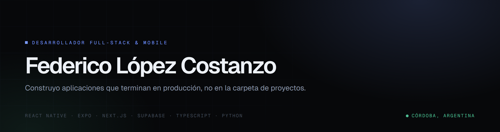
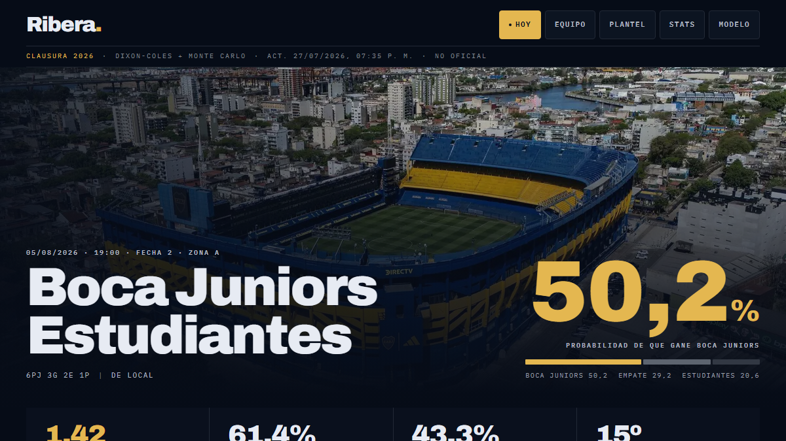
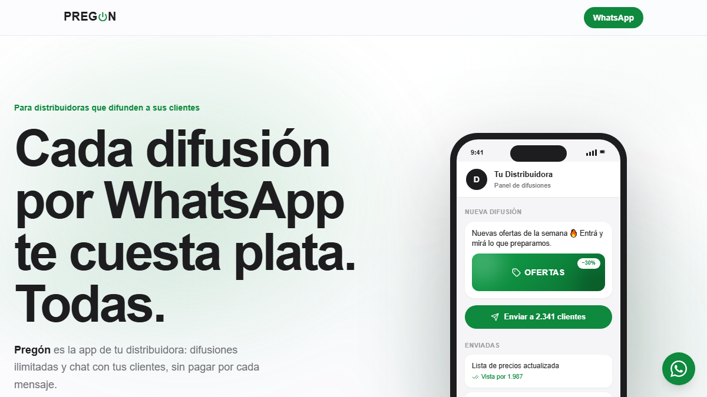
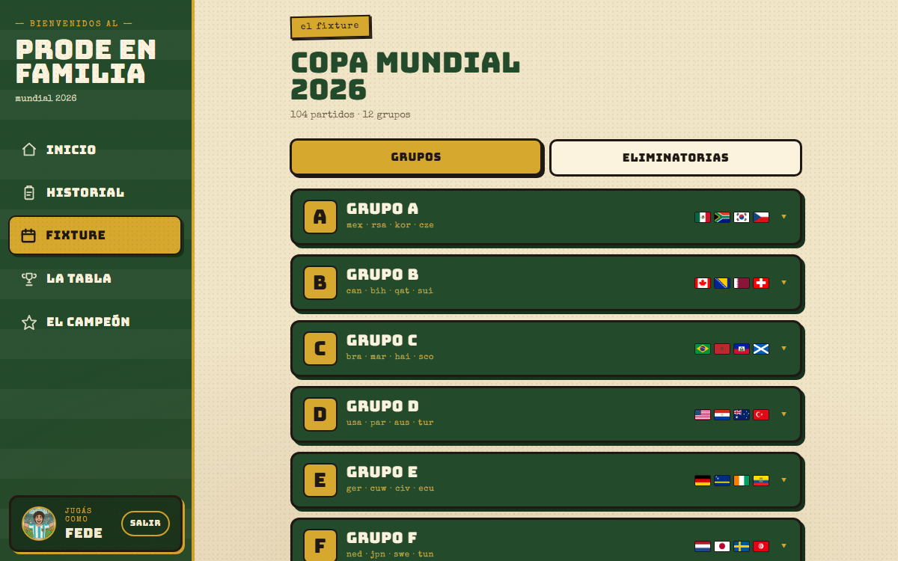

Desarrollo aplicaciones móviles y web. Hoy estoy construyendo **Pregón**, un producto
propio para distribuidoras, y doy clases de informática en un colegio secundario.

Lo que más me interesa no es la tecnología en sí, sino que lo que construyo termine
usándose: relevar con quien lo va a usar, entregarlo, y sostenerlo cuando aparecen
los problemas de verdad.

**Disponible full-time** · Córdoba, Argentina · remoto o híbrido

---

## App Azul · en producción

Aplicación de pedidos y comunicación para una distribuidora de alimentos congelados.
Me contrataron para desarrollarla, la hice completa y la publiqué en Google Play.
**Sigue en uso.**

Tres tipos de usuario con permisos distintos —comprador, vendedor y administración—,
chat interno, catálogo, avisos con confirmación de lectura y notificaciones push en
Android y iPhone. Me ocupé también de la publicación en la tienda y de cumplir los
requisitos de Apple y Google.

`React Native` `Expo SDK 54` `Supabase` `TypeScript` `EAS`

Permisos a nivel base de datos, Edge Functions y 82 tests automatizados.

> Código privado — es de un cliente.

---

## Ribera · modelo de predicción propio

Sitio que calcula qué chances tiene Boca en cada partido, con un modelo que construí
desde cero. Lo interesante no es que prediga: es que **está medido, y publico también
dónde pierde.**

Backtest walk-forward sobre **2.505 partidos**: en cada uno el modelo se entrenó de
nuevo usando sólo lo que se sabía hasta el día anterior, así que nunca vio el partido
que tenía que predecir.

| Quién predice mejor | Log loss |
|---|---|
| Las casas de apuestas | **1,0534** |
| Este modelo | **1,0629** |
| Tirar la frecuencia histórica | 1,0781 |
| Tirar una moneda de tres lados | 1,0986 |

Le gana a no saber nada por 0,0152 —que es lo que prueba que aporta información real
y no está adivinando—. A las casas de apuestas les pierde por 0,0095, y eso también
está publicado en el sitio.

Todo el proceso corre solo una vez por semana: descarga los datos, recalcula y publica.

`Python` `pandas` `scipy` `Dixon-Coles` `Monte Carlo` `Next.js` `GitHub Actions`

**[Ver el sitio](https://datafut.vercel.app)** · **[Código](https://github.com/Fede1808/datafut)**

---

## Pregón · producto propio, en marcha

Las distribuidoras difunden ofertas a sus clientes por WhatsApp y **pagan por cada
mensaje enviado.** Pregón les da su propia app: difusiones ilimitadas y chat con sus
clientes, sin costo por mensaje.

Nació de la app de Azul. Antes, cada cliente nuevo significaba rehacer la aplicación
entera; ahora se configura en un archivo y se entrega en una tarde. Escribí además el
método de implementación que siguen las distribuidoras para que sus clientes la
empiecen a usar.

`React Native` `Expo` `Supabase`

Configuración validada contra schema, credenciales de build separadas por cliente en
EAS y migraciones versionadas.

**[mipregon.com](https://mipregon.com)** · código privado

---

## Prode en Familia · en uso

Juego de pronósticos del Mundial 2026. Lo usa mi familia en cada fecha.

Lo hice para aprender la última versión de Next.js con usuarios reales exigiendo que
funcione. **56 versiones** ajustando las reglas de puntaje según lo que pedían los
jugadores, que es bastante más honesto que un proyecto de práctica.

`Next.js 16` `App Router` `Server Actions` `Supabase` `Tailwind v4` `Vercel`

**[Ver el sitio](https://prode-familia.vercel.app)** · **[Código](https://github.com/Fede1808/prode-familia)**

---

## Stack

| | |
|---|---|
| **Mobile** | React Native, Expo, EAS |
| **Web** | Next.js, React, Astro, Tailwind CSS |
| **Lenguajes** | TypeScript, JavaScript, Python, SQL |
| **Backend** | Supabase, PostgreSQL, FastAPI |
| **Datos** | pandas, scipy, Power BI |
| **Otros** | Git, GitHub Actions, Vercel, testing |

## Formación

**Ingeniería en Software** — Universidad Siglo 21 · último año, en curso

---

## Contacto

**[Portfolio](https://portfolio-fede-alpha.vercel.app)** ·
**[LinkedIn](https://www.linkedin.com/in/federicolopezcostanzo/)** ·
**[fede.fl73@gmail.com](mailto:fede.fl73@gmail.com)** ·
**[CV en PDF](https://portfolio-fede-alpha.vercel.app/cv.pdf)**
