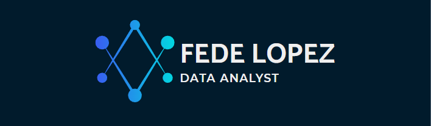

<h1 align="center">Hola, soy Fede👋</h1>

  

        <h2>🌟 About Me</h2>
        <ul>
            <li class="highlight">🚀 Junior Data Analyst 
            <li class="highlight">📚 High School CS Teacher 
            <li class="highlight">💡 IT Enthusiast 
        </ul>
    

   

    <h2>🛠️ Tech Toolkit</h2>
    

        🐍 Python | 📊 Power BI | 🗄️ SQL  📑 Excel | 🐼 Pandas | 📉 Matplotlib
    

    <h2>🎓 Education</h2>
    <ul>
        <li>🏛️ <strong>Systems Engineering</strong> | Universidad Tecnológica Nacional | 2019–2024</li>
        <li>💻 <strong>Software Engineering</strong> | Universidad Siglo 21 | 2024–Present</li>
    </ul>

    <h2>📚 Courses & Certifications</h2>
    <ul>
        <li>📊 <strong>SQL, Python & ChatGPT for Data Analysis</strong> | UDEMY | 2024</li>
        <li>🧠 <strong>Neural Networks with Python</strong> | FAMAF | 2023</li>
        <li>🚀 <strong>Advanced JavaScript Course</strong> | Coderhouse | 2022</li>
    </ul>

## 📊 Proyectos 
<table>
<tr>
<td width="50%">
<h3 align="center">⚽ FIFA Player Dashboard</h3>

📈 Dashboard interactivo para análisis de jugadores FIFA 
 🛠️ <strong>Tecnologías:</strong> Python, Power BI, Pandas
 ✨ Filtros dinámicos, comparativas entre jugadores, heatmaps

                                                                                      
</td>

<td width="50%">
<h3 align="center">💸 Budget Tracker</h3>

                                       

📉 Sistema de seguimiento de gastos e ingresos 
 🛠️ <strong>Tecnologías:</strong> Excel, Python, Openpyxl 
 ✨ Automatización de reportes, gráficos mensuales, alertas

                                                             
</td>
</tr>
</table>
